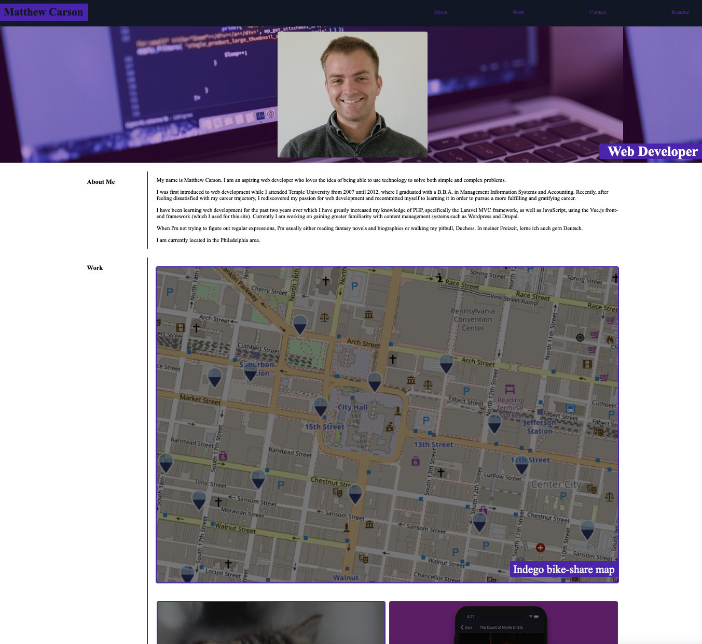

# Personal Portfolio

## Description

A portfolio to showcase my skills to potential employers in order to obtain a full-time web development position.

- Showcase previous project and skill
- Help to obtain a full-time development position.

## Screenshot

## Final Product

[View Here](https://mcarson24.github.io/personal_portfolio/)

## License

This project is open-sourced software and is licensed under the terms of the [MIT License](https://opensource.org/licenses/MIT).